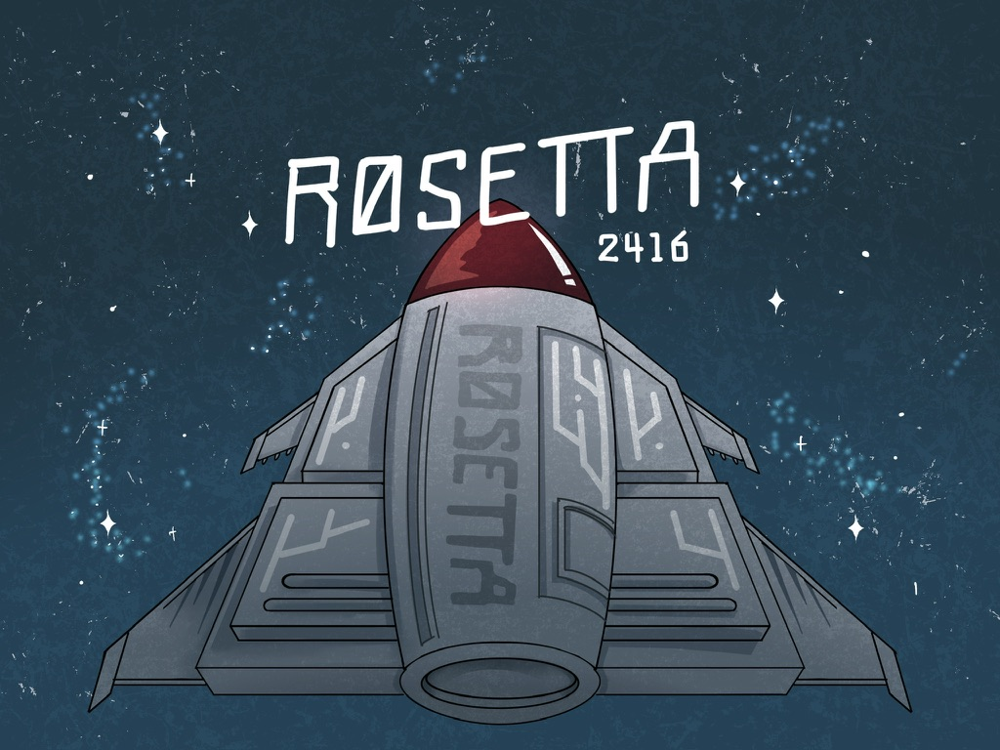
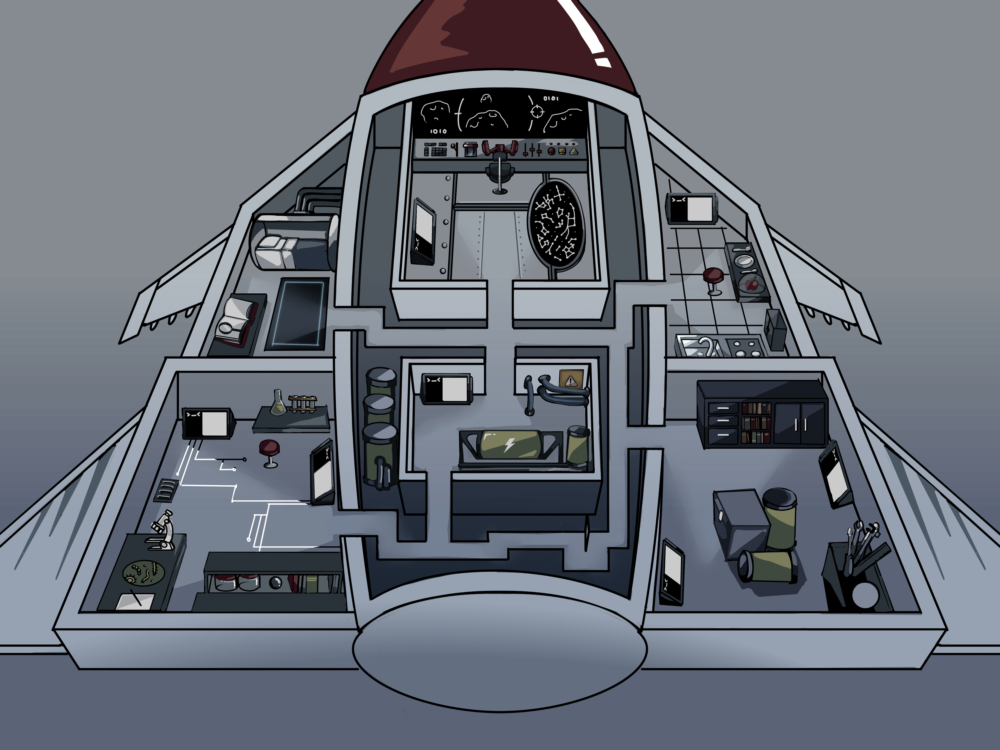
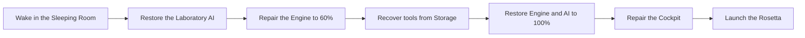
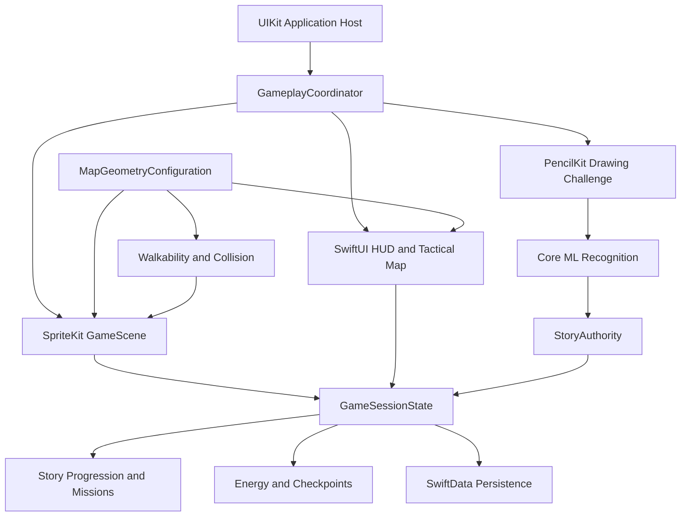

<p align="center">
  
</p>

<h1 align="center">ROSETTA 2416</h1>

<p align="center">
  <strong>Draw the repairs. Restore the ship. Find your way home.</strong>
</p>

<p align="center">
  A story-driven, top-down science-fiction adventure for iPhone and iPad,<br />
  where every drawing can bring a broken starship—and its fractured AI—back to life.
</p>

<p align="center">
  
  
  
  
</p>

---

## Table of Contents

- [The Story](#the-story)
- [The Core Experience](#the-core-experience)
- [Journey Through the Rosetta](#journey-through-the-rosetta)
- [Drawing as a Game Mechanic](#drawing-as-a-game-mechanic)
- [Controls](#controls)
- [Key Features](#key-features)
- [Architecture](#architecture)
- [Technology Stack](#technology-stack)
- [Project Structure](#project-structure)
- [Getting Started](#getting-started)
- [Testing](#testing)
- [Development Status](#development-status)
- [Team](#team)

---

## The Story

The year is **2416**. The exploration vessel **Rosetta** has been sent toward planet **C-4**, a potential new home for humanity. Only one human travels aboard the ship, resting in hibernation while its artificial intelligence handles navigation, maintenance, and the long silence between worlds.

Then the astronaut wakes months too early.

The Rosetta is drifting. Its engine is cold, its rooms are locked behind failing systems, and the AI that once kept everything alive has been fragmented. Emergency lighting is all that remains, and the astronaut's energy is slowly running out.

The ship's repair terminals do not respond to ordinary commands. They respond to **drawings**.

To survive, the player must explore the damaged vessel, discover active repair stations, sketch the objects requested by the ship, and rebuild the Rosetta one system at a time. Every successful drawing restores more than machinery: it recovers a piece of the AI, opens a new path, and brings the mission closer to launch.

> **Rosetta 2416 turns drawing into action.** A sketch is not a side activity—it is the tool the player uses to survive, progress, and complete the story.

## The Core Experience

| Pillar | What the player does | Why it matters |
|---|---|---|
| **Explore** | Navigate a connected, top-down spacecraft filled with locked doors, damaged terminals, and environmental hazards. | Each restored system reveals a new part of the ship and advances the narrative. |
| **Draw** | Use a finger or Apple Pencil to complete visual prompts on a PencilKit canvas. | An on-device Core ML model decides whether the sketch matches the requested object. |
| **Survive** | Manage a continuously draining Energy supply and return to the Kitchen when resources run low. | Reaching zero Energy triggers Game Over and returns the player to the latest safe checkpoint. |
| **Restore** | Recover AI Intelligence, rebuild Engine Progress, acquire advanced tools, and bring navigation back online. | Every milestone changes the ship's lighting, unlocks access, and moves the Rosetta closer to launch. |

The complete story contains **six major missions** and **19 repair drawing challenges**, plus repeatable Kitchen challenges for restoring Energy. Story prompts are selected by category and persisted for the current playthrough, giving each new session variation without breaking mission progression.

## Journey Through the Rosetta

<p align="center">
  
</p>

The ship is divided into six interconnected rooms. Access is controlled by the same story state that powers objectives, doors, lighting, checkpoints, and the Tactical Map.

| Area | Role in the journey | Access and progression |
|---|---|---|
| **Sleeping Room** | The astronaut's starting point and home of the visual reference Album. | Available from the beginning. |
| **Laboratory** | The first destination, where the player begins reconstructing the AI. | Reach the room, then complete three repair drawings to raise Intelligence to 40. |
| **Kitchen** | A permanent survival station with repeatable food-drawing challenges. | Always available; a successful drawing restores 50 Energy. |
| **Engine Room** | The heart of the Rosetta's recovery, repaired across two major phases. | Opens after the Laboratory. Initial repairs raise Engine Progress to 60 and trigger changing power states. |
| **Storage** | The location of the advanced calibration tools required for final repairs. | Opens after the initial Engine phase; three challenges must be completed before returning to the Engine Room. |
| **Cockpit** | The final destination and launch sequence. | Opens only after Intelligence and Engine Progress reach 100 and the advanced tools have been acquired. |

### Mission flow



Ship power evolves with the story: **Power Off → Basic Power → Disrupted → Fully Restored**. These states affect lighting, atmosphere, available routes, and the sense of urgency throughout the journey.

## Drawing as a Game Mechanic

Drawing challenges connect the game's narrative, machine learning, and player input in one continuous loop:

1. The story activates the next physical repair station.
2. A category-based prompt is selected from the model's supported label catalog.
3. The player draws the requested object with a finger or Apple Pencil.
4. PencilKit converts the strokes into drawing data for the local recognition pipeline.
5. `SketchClassifierV3` predicts a label and confidence score entirely on-device.
6. A valid result repairs the station, updates progression, records a checkpoint when appropriate, and reveals the next objective.

The prompt randomizer selects unique labels for each story chapter using a persisted story seed. The Kitchen uses a separate food pool and avoids immediately repeating the previous prompt. This makes replay sessions feel less predictable while preserving deterministic save and checkpoint behavior.

If repeated attempts fail, the in-world Album can provide a reference-oriented hint without bypassing the recognition challenge.

## Controls

| Input | Action |
|---|---|
| **Finger — virtual joystick** | Drag the on-screen joystick to move through rooms and corridors. |
| **Finger — interface** | Open the Tactical Map, pause the game, interact with active stations, and use drawing controls. |
| **Finger or Apple Pencil — canvas** | Draw, clear, retry, and submit repair or food prompts. |
| **Apple Pencil — world navigation** | Touch or drag toward a destination to move there. Pencil pressure adjusts travel speed from careful movement to a faster run. |

All movement is validated against the shared ship geometry, including walls, doors, furniture, machinery, and the player's collision footprint.

## Key Features

- **A complete story-driven progression loop** from awakening to launch, organized into six major missions.
- **19 story repair challenges** distributed across the Laboratory, Engine Room, Storage, and Cockpit.
- **On-device doodle recognition** powered by PencilKit and a custom Core ML classifier.
- **Randomized, category-aware prompts** that remain stable across saves and checkpoints.
- **A survival-focused Energy system** with passive drain, increased movement cost, low-energy warnings, Kitchen recovery, and Game Over recovery.
- **Dynamic ship restoration** with door unlocks, environmental lighting changes, cutscenes, smoke effects, dialogue, and repaired world objects.
- **A live Tactical Map** that displays the player, rooms, doors, destinations, active stations, checkpoints, and relevant landmarks.
- **One authoritative map pipeline** shared by SpriteKit rendering, collision, room access, and the SwiftUI Tactical Map.
- **Collision-aware movement** with player-footprint checks, obstacle clearance, corridor containment, and wall sliding.
- **Automatic SwiftData persistence** for current progress, randomized prompts, session statistics, and checkpoint snapshots.
- **Contextual AI dialogue** for chapter transitions, completed objectives, power events, access denial, and Energy warnings.
- **An interactive reference Album** that records drawing progress and helps players recover after repeated failures.
- **Main Menu, Continue, Pause, Game Over, and Victory flows**, including session statistics and a clean Play Again reset.
- **Original audiovisual presentation** with animated character art, illustrated ship environments, music, sound effects, and tactile button feedback.

## Architecture

Rosetta uses a **feature-oriented interface layer** around a **system-oriented game engine**. UIKit hosts the application and SpriteKit view, `GameplayCoordinator` connects the major features, and a single observable session state keeps gameplay, story, drawing, and overlays synchronized.



### Architectural principles

- **One map, multiple consumers.** `MapGeometryConfiguration` is compiled into the runtime world and consumed by rendering, walkability, collision, room detection, checkpoints, and the Tactical Map.
- **Systems own behavior.** Movement, collision, Energy, interaction, lighting, story progression, drawing validation, and checkpoint recovery are kept out of presentation code.
- **State drives presentation.** `GameSessionState` and `StoryProgressionSystem` use Observation so HUD and map surfaces update from the same authoritative state.
- **Commands protect progression.** Drawing and interaction requests pass through `StoryAuthority`, preventing duplicate processing and keeping recognition results tied to the active objective.
- **Persistence is snapshot-based.** SwiftData stores both the latest state and the last safe checkpoint, allowing Continue and Game Over recovery to serve different purposes.
- **Developer tooling is isolated.** The geometry editor, validation tools, collision inspection, and export workflow are available only behind an explicit Debug-build gate.

## Technology Stack

| Technology | Responsibility |
|---|---|
| **Swift 5** | Primary implementation language. |
| **UIKit** | Application lifecycle, root view controller, and SpriteKit hosting. |
| **SpriteKit** | World rendering, camera, character movement, animation, lighting, effects, and interaction nodes. |
| **SwiftUI** | Gameplay HUD, Tactical Map, story overlays, alerts, and drawing-screen layout. |
| **PencilKit** | Finger and Apple Pencil drawing input. |
| **Core ML** | Local sketch classification with `SketchClassifierV3`. |
| **SwiftData** | Save-game, checkpoint, and migration-aware local persistence. |
| **Observation** | Reactive session and story state shared across interface layers. |
| **Swift Testing** | Unit, integration, geometry, persistence, and gameplay regression coverage. |

## Project Structure

```text
Rosetta/
├── App/                         # App and scene lifecycle
├── Core/                        # Shared debug configuration and utilities
├── Data/
│   ├── Persistence/             # SwiftData implementation
│   └── Repositories/            # Persistence contracts and save models
├── Dialogue/                    # AI dialogue models, manager, and JSON content
├── Drawing/
│   └── Recognition/             # Core ML pipeline, label catalog, and randomizer
├── Features/
│   ├── AlbumBook/               # Reference Album state and presentation
│   ├── DrawingChallenge/        # PencilKit mission canvas
│   ├── Gameplay/                # Coordinator, controller, input, and HUD
│   ├── MapDebug/                # Debug-only geometry editor and validation UI
│   ├── Story/                   # Story, checkpoint, Game Over, and Victory overlays
│   └── TacticalMap/             # Live vector map and coordinate conversion
├── GameEngine/
│   ├── Map/                     # Canonical map geometry and editor data flow
│   ├── Missions/                # Missions, prompt preparation, and station visibility
│   ├── Nodes/                   # Player, repair stations, props, and effects
│   ├── Scenes/                  # Prologue, menu, gameplay, and launch scenes
│   ├── State/                   # Session, player, survival, and phase state
│   ├── Story/                   # Chapters, objectives, authority, and progression
│   ├── Systems/                 # Movement, collision, Energy, lighting, and interaction
│   └── World/                   # Runtime world construction and ship rendering
└── Resources/                   # Art, audio, fonts, story data, and Core ML model

RosettaTests/        # 100+ focused tests across the game systems
```

## Getting Started

### Requirements

- macOS with **Xcode 26 or later**
- An **iOS 26 / iPadOS 26 simulator** or compatible physical device
- Apple Pencil is optional; every drawing challenge also supports finger input

### Run the game

```bash
git clone https://github.com/C4-team-H/JoystickAndCanvas.git
cd JoystickAndCanvas
open Rosetta.xcodeproj
```

Then:

1. Select the `Rosetta` scheme.
2. Choose an iPhone or iPad simulator, or a connected device.
3. Build and run with <kbd>⌘R</kbd>.
4. Choose **NEW GAME** to begin the prologue, or **CONTINUE GAME** when a saved session is available.

### Debug map editor

The live geometry editor is intentionally disabled by default. Maintainers can enable `DebugAvailability.enableDebugMode` for a Debug build and add the `-ShipMapDebug` launch argument when geometry inspection or collision testing is required. The editor remains unavailable in Release builds.

## Testing

Run the full test target from Xcode with <kbd>⌘U</kbd>, or use the command line:

```bash
xcodebuild test \
  -project Rosetta.xcodeproj \
  -scheme Rosetta \
  -destination 'platform=iOS Simulator,name=iPhone 17' \
  CODE_SIGNING_ALLOWED=NO
```

The test suite covers story progression, drawing randomization, Core ML label compatibility, Energy rules, persistence and migration, checkpoints, map topology, room reachability, collision behavior, Tactical Map alignment, lighting, interaction nodes, menu flows, and regression-sensitive gameplay architecture.

## Development Status

Rosetta 2416 is in **active development**. The complete single-player story loop, drawing recognition, ship exploration, progression, persistence, checkpoint recovery, Tactical Map, Game Over, and Victory flow are implemented.

Current work is focused on:

- final HUD, mission tracker, dialogue, and interaction-button polish;
- expanding environmental feedback, animation, and narrative dialogue;
- refining sprite integration for interactive stations and ship machinery;
- playtesting drawing difficulty, Energy balance, accessibility, and device performance;
- strengthening automated regression coverage as the world and presentation evolve.

The codebase includes state models that can represent a teammate, but a production multiplayer transport is **not currently implemented**. The present game experience is single-player.

## Team

Created by **[C4-team-H](https://github.com/C4-team-H)** as a collaborative iOS game project.

Explore the source, follow development, or contribute through the **[JoystickAndCanvas repository](https://github.com/C4-team-H/JoystickAndCanvas)**.
