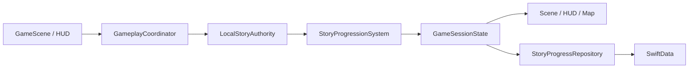

<<<<<<< ours
# Drawing Space — Folder Structure & Architecture

## 1. Ringkasan Proyek

**Drawing Space** adalah game eksplorasi top-down 2D untuk iOS dan iPadOS yang menggabungkan:

- **SwiftUI** untuk menu, lobby, HUD, tactical map, settings, dan result screen.
- **SpriteKit** untuk game loop, world simulation, collision, camera, karakter, mission station, dan efek visual.
- **PencilKit** untuk drawing canvas menggunakan jari atau Apple Pencil.
- **Core ML** untuk mengenali doodle pemain.
- **GameKit** sebagai fondasi multiplayer co-op dua pemain.
- **SwiftData** untuk penyimpanan lokal dan progression.
- **GameplayKit** secara opsional untuk state machine dan game logic tambahan.

Arsitektur menggunakan pendekatan:

> **Feature-first untuk UI, system-oriented untuk game engine, dan protocol-oriented untuk service eksternal.**

Tujuan utamanya adalah menjaga project tetap sederhana saat masih single-player, tetapi tidak perlu dibongkar total saat multiplayer co-op mulai diaktifkan.

---

## 2. Tujuan Arsitektur

Arsitektur ini dirancang agar:

1. `GameScene.swift` tidak berubah menjadi file raksasa.
2. SwiftUI tidak menyimpan logic collision atau game simulation.
3. PencilKit dan Core ML tidak terikat langsung ke UI.
4. GameKit dapat diganti dengan Multipeer Connectivity, Nakama, atau backend lain.
5. Tactical map membaca posisi resmi game, bukan menyimpan duplikat state.
6. Multiplayer dapat menggunakan pendekatan host-authoritative.
7. Unit test dapat dijalankan tanpa membuka seluruh SpriteKit scene.
8. Setiap feature memiliki tanggung jawab yang jelas.
9. Dependency eksternal mudah diganti menggunakan protocol.
10. Project tetap realistis untuk MVP tanpa menjadi terlalu kompleks.

---

## 3. High-Level Architecture

```text
┌────────────────────────────────────────────────────────────┐
│                         SwiftUI App                        │
│                                                            │
│  Main Menu · Lobby · Gameplay HUD · Map · Drawing · Result│
└──────────────────────────────┬─────────────────────────────┘
                               │
                               ▼
┌────────────────────────────────────────────────────────────┐
│                    Gameplay Coordinator                   │
│                                                            │
│ Menjembatani SwiftUI, SpriteKit, Drawing, dan Multiplayer │
└───────────────┬───────────────────────┬────────────────────┘
                │                       │
                ▼                       ▼
┌──────────────────────────┐  ┌──────────────────────────────┐
│      SpriteKit Engine    │  │      Drawing Recognition    │
│                          │  │                              │
│ Scene · Systems · Nodes  │  │ PencilKit · Preprocessing   │
│ Physics · World · State  │  │ Core ML · Recognition Result│
└───────────────┬──────────┘  └───────────────┬──────────────┘
                │                             │
                └──────────────┬──────────────┘
                               ▼
┌────────────────────────────────────────────────────────────┐
│                     Game Session State                    │
│                                                            │
│ Player · Mission · Energy · Game Phase · Teammate · Result│
└──────────────────────────────┬─────────────────────────────┘
                               │
                 ┌─────────────┴──────────────┐
                 ▼                            ▼
┌──────────────────────────┐       ┌──────────────────────────┐
│ Multiplayer / Networking │       │       Persistence        │
│                          │       │                          │
│ GameKit · Sync · Snapshot│       │ SwiftData · Settings     │
│ Reconnect · Host Authority│      │ Save Game · Progress     │
└──────────────────────────┘       └──────────────────────────┘
```

---

## 4. Folder Structure

```text
DrawingSpace/
│
├── App/
│   ├── DrawingSpaceApp.swift
│   ├── AppCoordinator.swift
│   ├── AppState.swift
│   └── DependencyContainer.swift
│
├── Core/
│   ├── Extensions/
│   │   ├── CGPoint+Extensions.swift
│   │   ├── CGSize+Extensions.swift
│   │   ├── SKNode+Extensions.swift
│   │   └── View+Extensions.swift
│   │
│   ├── Utilities/
│   │   ├── Logger.swift
│   │   ├── HapticManager.swift
│   │   ├── Randomizer.swift
│   │   └── Constants.swift
│   │
│   ├── Protocols/
│   │   ├── Resettable.swift
│   │   ├── Updatable.swift
│   │   └── GameEventListener.swift
│   │
│   └── DesignSystem/
│       ├── AppColors.swift
│       ├── AppFonts.swift
│       ├── AppSpacing.swift
│       └── Components/
│           ├── PrimaryButton.swift
│           ├── CircularIconButton.swift
│           └── GamePanel.swift
│
├── Features/
│   ├── MainMenu/
│   │   ├── MainMenuView.swift
│   │   └── MainMenuViewModel.swift
│   │
│   ├── Lobby/
│   │   ├── LobbyView.swift
│   │   ├── LobbyViewModel.swift
│   │   ├── PlayerReadyCard.swift
│   │   └── RoomCodeView.swift
│   │
│   ├── Gameplay/
│   │   ├── GameplayView.swift
│   │   ├── GameplayViewModel.swift
│   │   ├── GameplayCoordinator.swift
│   │   │
│   │   ├── HUD/
│   │   │   ├── GameplayHUDView.swift
│   │   │   ├── EnergyBarView.swift
│   │   │   ├── MissionProgressView.swift
│   │   │   ├── InteractionButton.swift
│   │   │   └── MapButton.swift
│   │   │
│   │   └── Input/
│   │       ├── VirtualJoystickView.swift
│   │       ├── JoystickState.swift
│   │       └── PencilMovementInput.swift
│   │
│   ├── DrawingChallenge/
│   │   ├── DrawingChallengeView.swift
│   │   ├── DrawingChallengeViewModel.swift
│   │   ├── DrawingChallengeState.swift
│   │   ├── DrawingPromptView.swift
│   │   ├── DrawingResultView.swift
│   │   └── Components/
│   │       ├── DrawingToolbar.swift
│   │       └── PredictionConfidenceView.swift
│   │
│   ├── TacticalMap/
│   │   ├── TacticalMapView.swift
│   │   ├── TacticalMapViewModel.swift
│   │   ├── MapCoordinateConverter.swift
│   │   ├── MapMarker.swift
│   │   ├── MapMarkerType.swift
│   │   ├── MapPlayerMarkerView.swift
│   │   ├── MapMissionMarkerView.swift
│   │   └── MapLegendView.swift
│   │
│   ├── Results/
│   │   ├── VictoryView.swift
│   │   ├── GameOverView.swift
│   │   └── ResultsViewModel.swift
│   │
│   └── Settings/
│       ├── SettingsView.swift
│       └── SettingsViewModel.swift
│
├── GameEngine/
│   ├── Scenes/
│   │   ├── GameScene.swift
│   │   ├── LoadingScene.swift
│   │   └── SceneFactory.swift
│   │
│   ├── World/
│   │   ├── GameWorld.swift
│   │   ├── WorldBounds.swift
│   │   ├── RoomDefinition.swift
│   │   ├── DoorDefinition.swift
│   │   ├── SpawnPoint.swift
│   │   └── WorldLoader.swift
│   │
│   ├── Nodes/
│   │   ├── Player/
│   │   │   ├── PlayerNode.swift
│   │   │   ├── PlayerAnimationController.swift
│   │   │   └── PlayerMovementController.swift
│   │   │
│   │   ├── Mission/
│   │   │   ├── MissionStationNode.swift
│   │   │   ├── EaselNode.swift
│   │   │   └── FoodStationNode.swift
│   │   │
│   │   ├── Environment/
│   │   │   ├── WallNode.swift
│   │   │   ├── DoorNode.swift
│   │   │   ├── RoomNode.swift
│   │   │   └── CheckpointNode.swift
│   │   │
│   │   └── Effects/
│   │       ├── CandleLightNode.swift
│   │       ├── GlowEffectNode.swift
│   │       └── PulseEffectNode.swift
│   │
│   ├── Systems/
│   │   ├── MovementSystem.swift
│   │   ├── CollisionSystem.swift
│   │   ├── CameraSystem.swift
│   │   ├── InteractionSystem.swift
│   │   ├── MissionSystem.swift
│   │   ├── EnergySystem.swift
│   │   ├── LightingSystem.swift
│   │   └── GameRulesSystem.swift
│   │
│   ├── State/
│   │   ├── GameSessionState.swift
│   │   ├── PlayerState.swift
│   │   ├── MissionState.swift
│   │   ├── EnergyState.swift
│   │   └── GamePhase.swift
│   │
│   ├── Events/
│   │   ├── GameEvent.swift
│   │   ├── GameEventBus.swift
│   │   └── GameEventPayload.swift
│   │
│   └── Physics/
│       ├── PhysicsCategory.swift
│       ├── CollisionHandler.swift
│       └── PhysicsBodyFactory.swift
│
├── Drawing/
│   ├── Canvas/
│   │   ├── PencilCanvasView.swift
│   │   ├── PencilCanvasCoordinator.swift
│   │   └── DrawingSession.swift
│   │
│   ├── Recognition/
│   │   ├── DoodleRecognizer.swift
│   │   ├── CoreMLDoodleRecognizer.swift
│   │   ├── RecognitionResult.swift
│   │   ├── RecognitionLabel.swift
│   │   └── RecognitionThreshold.swift
│   │
│   ├── Preprocessing/
│   │   ├── DrawingImageRenderer.swift
│   │   ├── DrawingCropper.swift
│   │   ├── ImageNormalizer.swift
│   │   └── ImagePreprocessingPipeline.swift
│   │
│   └── Stroke/
│       ├── StrokeData.swift
│       ├── StrokePoint.swift
│       ├── StrokeRecorder.swift
│       └── StrokeSerializer.swift
│
├── Multiplayer/
│   ├── Core/
│   │   ├── MultiplayerService.swift
│   │   ├── MultiplayerState.swift
│   │   ├── MultiplayerError.swift
│   │   └── ConnectionStatus.swift
│   │
│   ├── GameKit/
│   │   ├── GameCenterAuthenticator.swift
│   │   ├── GameKitMultiplayerService.swift
│   │   ├── GameKitMatchDelegate.swift
│   │   └── MatchmakingCoordinator.swift
│   │
│   ├── Local/
│   │   └── MultipeerConnectivityService.swift
│   │
│   ├── Messages/
│   │   ├── GameMessage.swift
│   │   ├── MessageEnvelope.swift
│   │   ├── PlayerInputMessage.swift
│   │   ├── PlayerStateMessage.swift
│   │   ├── MissionMessage.swift
│   │   ├── StrokeMessage.swift
│   │   └── SnapshotMessage.swift
│   │
│   ├── Synchronization/
│   │   ├── StateSynchronizer.swift
│   │   ├── PlayerPositionSynchronizer.swift
│   │   ├── MissionSynchronizer.swift
│   │   ├── StrokeSynchronizer.swift
│   │   ├── SnapshotManager.swift
│   │   └── ReconnectionManager.swift
│   │
│   └── Authority/
│       ├── HostAuthorityManager.swift
│       ├── HostElection.swift
│       └── InputValidator.swift
│
├── Data/
│   ├── Models/
│   │   ├── PlayerProfile.swift
│   │   ├── SavedGame.swift
│   │   ├── MissionRecord.swift
│   │   └── GameSettings.swift
│   │
│   ├── Repositories/
│   │   ├── PlayerRepository.swift
│   │   ├── GameProgressRepository.swift
│   │   └── SettingsRepository.swift
│   │
│   ├── Persistence/
│   │   ├── SwiftDataContainer.swift
│   │   ├── LocalPlayerRepository.swift
│   │   └── LocalGameProgressRepository.swift
│   │
│   └── Configuration/
│       ├── GameConfiguration.swift
│       ├── MissionConfiguration.swift
│       └── DifficultyConfiguration.swift
│
├── Resources/
│   ├── Assets.xcassets
│   ├── Audio/
│   │   ├── Music/
│   │   └── SoundEffects/
│   │
│   ├── Maps/
│   │   ├── StationMap.json
│   │   └── StationMapPreview.png
│   │
│   ├── MLModels/
│   │   └── DoodleClassifier.mlpackage
│   │
│   ├── Particles/
│   ├── Shaders/
│   └── Localization/
│       ├── Localizable.xcstrings
│       └── InfoPlist.xcstrings
│
├── PreviewContent/
│   ├── MockGameSession.swift
│   ├── MockMultiplayerService.swift
│   ├── MockDoodleRecognizer.swift
│   └── PreviewAssets.xcassets
│
└── Tests/
    ├── UnitTests/
    │   ├── EnergySystemTests.swift
    │   ├── MissionSystemTests.swift
    │   ├── MapCoordinateConverterTests.swift
    │   ├── DrawingPreprocessingTests.swift
    │   ├── RecognitionTests.swift
    │   └── MessageEncodingTests.swift
    │
    ├── IntegrationTests/
    │   ├── GameplayFlowTests.swift
    │   ├── MultiplayerSynchronizationTests.swift
    │   └── DrawingChallengeFlowTests.swift
    │
    └── UITests/
        ├── MainMenuUITests.swift
        ├── TacticalMapUITests.swift
        └── DrawingChallengeUITests.swift
```

---

## 5. Tanggung Jawab Folder

### 5.1 `App/`

Berisi entry point, navigation flow, dan dependency composition.

#### `DrawingSpaceApp.swift`

- Entry point aplikasi.
- Membuat `DependencyContainer`.
- Menyediakan `AppState` ke seluruh SwiftUI hierarchy.

#### `AppCoordinator.swift`

Mengelola flow utama:

```text
Main Menu
    ↓
Lobby / Matchmaking
    ↓
Gameplay
    ↓
Victory / Game Over
```

Coordinator tidak berisi gameplay logic.

#### `DependencyContainer.swift`

Tempat membuat dependency konkret.

```swift
final class DependencyContainer {
    let doodleRecognizer: DoodleRecognizer
    let multiplayerService: MultiplayerService
    let gameProgressRepository: GameProgressRepository

    init() {
        doodleRecognizer = CoreMLDoodleRecognizer()
        multiplayerService = GameKitMultiplayerService()
        gameProgressRepository = LocalGameProgressRepository()
    }
}
```

Saat development atau SwiftUI Preview, dependency dapat diganti dengan mock.

---

### 5.2 `Core/`

Berisi kode generik yang tidak terikat langsung pada satu feature.

Contoh:

- Extension `CGPoint`.
- Logger.
- Haptic manager.
- Konstanta.
- Design system.
- Reusable button.
- Protocol umum.

Jangan menaruh `EnergySystem`, `MissionSystem`, atau logic Core ML di folder ini.

---

### 5.3 `Features/`

Berisi UI dan presentation logic berdasarkan feature.

Struktur umum:

```text
FeatureName/
├── FeatureView.swift
├── FeatureViewModel.swift
├── FeatureState.swift
└── Components/
```

Feature tidak boleh membuat service konkret sendiri.

#### Hindari

```swift
final class DrawingChallengeViewModel {
    private let recognizer = CoreMLDoodleRecognizer()
}
```

#### Gunakan dependency injection

```swift
final class DrawingChallengeViewModel {
    private let recognizer: DoodleRecognizer

    init(recognizer: DoodleRecognizer) {
        self.recognizer = recognizer
    }
}
```

---

### 5.4 `GameEngine/`

Berisi seluruh simulation layer.

#### Scene

`GameScene` mengatur lifecycle SpriteKit dan menjalankan system.

```swift
final class GameScene: SKScene {
    private let movementSystem: MovementSystem
    private let energySystem: EnergySystem
    private let missionSystem: MissionSystem
    private let lightingSystem: LightingSystem

    override func update(_ currentTime: TimeInterval) {
        movementSystem.update(currentTime)
        energySystem.update(currentTime)
        missionSystem.update(currentTime)
        lightingSystem.update(currentTime)
    }
}
```

`GameScene` tidak seharusnya:

- melakukan Core ML inference;
- membuka SwiftUI sheet;
- melakukan authentication;
- menyimpan data ke SwiftData;
- mengirim raw GameKit message;
- memuat seluruh collision logic dalam satu file.

#### Nodes

Node adalah representasi visual atau physical object:

- `PlayerNode`
- `WallNode`
- `DoorNode`
- `MissionStationNode`
- `FoodStationNode`
- `CheckpointNode`
- `CandleLightNode`

Node tidak menentukan aturan game besar.

```swift
final class MissionStationNode: SKSpriteNode {
    let missionID: UUID
    let stationType: MissionStationType
}
```

Keputusan apakah mission selesai tetap dilakukan oleh `MissionSystem`.

#### Systems

| System | Tanggung jawab |
|---|---|
| `MovementSystem` | Mengubah input menjadi pergerakan |
| `CollisionSystem` | Menangani dinding, pintu, dan obstacle |
| `CameraSystem` | Mengikuti karakter dan membatasi kamera |
| `InteractionSystem` | Menentukan object interaktif terdekat |
| `MissionSystem` | Mengelola mission aktif dan selesai |
| `EnergySystem` | Mengurangi dan memulihkan energi |
| `LightingSystem` | Mengelola candle-light dan visibility |
| `GameRulesSystem` | Menentukan menang, kalah, dan restart |

---

### 5.5 `Drawing/`

Berisi seluruh pipeline PencilKit dan Core ML.

```text
PKDrawing
    ↓
DrawingImageRenderer
    ↓
DrawingCropper
    ↓
ImageNormalizer
    ↓
CoreMLDoodleRecognizer
    ↓
RecognitionResult
```

#### Recognition abstraction

```swift
protocol DoodleRecognizer {
    func recognize(_ drawing: PKDrawing) async throws -> RecognitionResult
}
```

Implementasi awal:

```swift
final class CoreMLDoodleRecognizer: DoodleRecognizer {
    func recognize(_ drawing: PKDrawing) async throws -> RecognitionResult {
        // Render, preprocess, dan classify.
    }
}
```

Implementasi masa depan:

```text
VisionDoodleRecognizer
FoundationModelDoodleRecognizer
HybridDoodleRecognizer
RemoteDoodleRecognizer
```

#### Recognition result

```swift
struct RecognitionResult: Sendable {
    let label: RecognitionLabel
    let confidence: Double
    let alternatives: [RecognitionCandidate]
}
```

View tidak menerima raw `VNClassificationObservation`.

---

### 5.6 `Multiplayer/`

Berisi transport, message, synchronization, dan host authority.

#### Transport abstraction

```swift
protocol MultiplayerService {
    var connectionState: ConnectionStatus { get }
    var incomingMessages: AsyncStream<GameMessage> { get }

    func authenticate() async throws
    func createMatch() async throws
    func send(_ message: GameMessage) async throws
    func disconnect()
}
```

Implementasi dapat berupa:

```text
GameKitMultiplayerService
MultipeerConnectivityService
NakamaMultiplayerService
MockMultiplayerService
```

#### Network message

Jangan mengirim seluruh `GameScene`.

Kirim event atau state yang diperlukan:

```swift
enum GameMessage: Codable {
    case playerInput(PlayerInputMessage)
    case playerState(PlayerStateMessage)
    case mission(MissionMessage)
    case stroke(StrokeMessage)
    case snapshot(SnapshotMessage)
    case ping(PingMessage)
}
```

#### Synchronization components

| Component | Fungsi |
|---|---|
| `StateSynchronizer` | Mengarahkan message ke state yang sesuai |
| `PlayerPositionSynchronizer` | Mengelola posisi remote player |
| `MissionSynchronizer` | Menyamakan status mission |
| `StrokeSynchronizer` | Mengirim dan membangun ulang stroke |
| `SnapshotManager` | Membuat full-state checkpoint |
| `ReconnectionManager` | Memulihkan state setelah reconnect |

#### Host-authoritative MVP

```text
Player 1 = Host
Player 2 = Client
```

Host bertanggung jawab atas:

- posisi resmi;
- collision;
- mission result;
- energi;
- kemenangan;
- game over;
- drawing recognition result;
- checkpoint.

Client mengirim input, bukan menentukan hasil resmi.

---

### 5.7 `Data/`

Berisi persistence dan repository.

UI dan GameEngine tidak mengakses SwiftData secara langsung.

```swift
protocol GameProgressRepository {
    func loadProgress() async throws -> SavedGame?
    func saveProgress(_ progress: SavedGame) async throws
    func deleteProgress() async throws
}
```

Implementasi awal:

```text
LocalGameProgressRepository
```

Implementasi masa depan:

```text
CloudGameProgressRepository
NakamaGameProgressRepository
```

---

### 5.8 `Resources/`

Berisi asset non-code:

- Texture.
- Audio.
- Shader.
- Particle effect.
- JSON map.
- Map preview.
- Core ML model.
- Localization.

---

## 6. Source of Truth

Aturan utama:

> Satu jenis state hanya boleh memiliki satu sumber kebenaran resmi.

| State | Source of truth |
|---|---|
| Posisi karakter | `PlayerState` dalam `GameSessionState` |
| Collision result | `CollisionSystem` |
| Energi | `EnergyState` |
| Mission progress | `MissionState` |
| Fase permainan | `GamePhase` |
| Posisi teammate | Remote `PlayerState` hasil sinkronisasi |
| Drawing sementara | `DrawingSession` |
| Drawing prediction | `RecognitionResult` |
| Map presentation | `TacticalMapViewModel` |
| Connection state | `MultiplayerState` |
| Save data | Repository |

### Hindari state ganda

```text
GameScene.player.position
GameplayViewModel.playerPosition
TacticalMapViewModel.playerPosition
MultiplayerState.playerPosition
```

Empat properti tersebut tidak boleh menjadi state independen yang dapat berubah sendiri-sendiri.

Gunakan satu state resmi, lalu layer lain hanya membaca atau melakukan binding.

---

## 7. Game Session State

```swift
@MainActor
final class GameSessionState: ObservableObject {
    @Published private(set) var phase: GamePhase = .preparing
    @Published private(set) var localPlayer: PlayerState
    @Published private(set) var teammate: PlayerState?
    @Published private(set) var energy: EnergyState
    @Published private(set) var missions: [MissionState]

    func apply(_ event: GameEvent) {
        // Update state melalui event resmi.
    }
}
```

### Game phase

```swift
enum GamePhase: Equatable {
    case preparing
    case playing
    case drawing(MissionID)
    case victory
    case gameOver
    case disconnected
}
```

---

## 8. Event Flow

```swift
enum GameEvent {
    case playerMoved(PlayerID, CGPoint)
    case interactionAvailable(InteractionTarget?)
    case drawingRequested(MissionID)
    case drawingRecognized(MissionID, RecognitionResult)
    case missionCompleted(MissionID)
    case energyChanged(Double)
    case teammateDisconnected
    case gameWon
    case gameLost
}
```

### Mission flow

```text
Player mendekati easel
        ↓
InteractionSystem mendeteksi station
        ↓
GameEvent.interactionAvailable
        ↓
HUD menampilkan tombol DRAW
        ↓
Player menekan DRAW
        ↓
DrawingChallenge dibuka
        ↓
Core ML mengembalikan RecognitionResult
        ↓
MissionSystem memvalidasi label
        ↓
GameSessionState diperbarui
        ↓
HUD dan Tactical Map ikut diperbarui
```

---

## 9. Gameplay Data Flow

```text
Joystick / Apple Pencil movement input
                ↓
        GameplayViewModel
                ↓
       GameplayCoordinator
                ↓
          MovementSystem
                ↓
         CollisionSystem
                ↓
          PlayerState
                ↓
    PlayerNode + Camera + Map Marker
```

SwiftUI tidak langsung mengubah `SKNode.position`.

---

## 10. Drawing Challenge Flow

```text
Mission station aktif
        ↓
DrawingChallengeView
        ↓
PencilCanvasView
        ↓
PKDrawing
        ↓
ImagePreprocessingPipeline
        ↓
DoodleRecognizer
        ↓
RecognitionResult
        ↓
MissionSystem
        ↓
MissionState
```

### Preprocessing yang direkomendasikan

1. Render drawing di atas background putih.
2. Crop berdasarkan drawing bounds.
3. Tambahkan padding.
4. Resize sesuai ukuran input model.
5. Normalize orientation dan scale.
6. Jalankan inference.
7. Terapkan confidence threshold.
8. Kembalikan `unknown` saat confidence terlalu rendah.

---

## 11. Tactical Map Architecture

```text
GameSessionState
├── Local player position
├── Teammate position
├── Mission states
├── Door states
└── Checkpoints
        ↓
TacticalMapViewModel
        ↓
MapCoordinateConverter
        ↓
TacticalMapView
```

Tactical map tidak meminta posisi langsung dari `SKNode`.

### Coordinate conversion

```swift
struct MapCoordinateConverter {
    let worldSize: CGSize
    let displayedMapFrame: CGRect

    func convert(_ worldPosition: CGPoint) -> CGPoint {
        let normalizedX = worldPosition.x / worldSize.width
        let normalizedY = worldPosition.y / worldSize.height

        let mapX = displayedMapFrame.minX
            + normalizedX * displayedMapFrame.width

        let mapY = displayedMapFrame.maxY
            - normalizedY * displayedMapFrame.height

        return CGPoint(x: mapX, y: mapY)
    }
}
```

Converter harus diuji untuk:

- sudut kiri bawah;
- sudut kanan atas;
- titik tengah;
- posisi di luar world bounds;
- aspect-fit map;
- ukuran iPhone dan iPad;
- pembalikan sumbu Y.

---

## 12. Multiplayer Architecture

### 12.1 Host-authoritative flow

```text
Client input
    ↓
Host menerima input
    ↓
Host menjalankan game rules
    ↓
Host memperbarui official state
    ↓
Host mengirim state ke client
```

Contoh:

```text
Client: "Move right"
Host: validate → collision → final position
Host: "Official position = (820, 430)"
```

Jangan mengirim:

```text
Client: "Mission complete"
```

Kirim:

```text
Client: "Submit drawing"
Host: classify → validate → mission complete
```

### 12.2 Reliable messages

Gunakan untuk:

- mission complete;
- drawing submitted;
- item collected;
- energy restored;
- game over;
- victory;
- player ready;
- snapshot;
- reconnect state.

### 12.3 Unreliable messages

Gunakan untuk:

- movement input;
- cursor position;
- temporary Pencil preview;
- animation direction;
- frequently refreshed position.

---

## 13. Dependency Rules

Dependency direction:

```text
Features
   ↓
Protocols / Domain State
   ↓
Services and Engine Implementations
```

### Diperbolehkan

```text
GameplayView → GameplayViewModel
GameplayViewModel → GameplayCoordinator
GameplayCoordinator → GameSessionState
GameplayCoordinator → MultiplayerService protocol
DrawingChallengeViewModel → DoodleRecognizer protocol
```

### Tidak diperbolehkan

```text
GameScene → SwiftUI View
PlayerNode → SwiftData
TacticalMapView → GameKit
DrawingChallengeView → Core ML model class
EnergySystem → UIKit presentation
MultiplayerService → SwiftUI navigation
```

---

## 14. Protocol yang Dibuat Sejak Awal

### Doodle recognizer

```swift
protocol DoodleRecognizer {
    func recognize(_ drawing: PKDrawing) async throws -> RecognitionResult
}
```

### Multiplayer service

```swift
protocol MultiplayerService {
    var incomingMessages: AsyncStream<GameMessage> { get }

    func authenticate() async throws
    func createMatch() async throws
    func send(_ message: GameMessage) async throws
    func disconnect()
}
```

### Game progress repository

```swift
protocol GameProgressRepository {
    func loadProgress() async throws -> SavedGame?
    func saveProgress(_ progress: SavedGame) async throws
    func clearProgress() async throws
}
```

### World loader

```swift
protocol WorldLoading {
    func loadWorld(named name: String) throws -> GameWorld
}
```

---

## 15. Struktur MVP yang Lebih Sederhana

Tidak semua folder harus dibuat sejak hari pertama.

```text
DrawingSpace/
├── App/
├── Core/
├── Features/
│   ├── MainMenu/
│   ├── Gameplay/
│   ├── DrawingChallenge/
│   ├── TacticalMap/
│   └── Results/
├── GameEngine/
│   ├── Scenes/
│   ├── Nodes/
│   ├── Systems/
│   └── State/
├── Drawing/
│   ├── Canvas/
│   ├── Recognition/
│   └── Preprocessing/
├── Multiplayer/
│   ├── Core/
│   ├── Messages/
│   └── GameKit/
├── Data/
├── Resources/
└── Tests/
```

Tambahkan subfolder baru hanya ketika sudah ada dua atau tiga file yang memang perlu dikelompokkan.

---

## 16. Urutan Implementasi

### Phase 1 — Core game

```text
DrawingSpaceApp.swift
GameplayView.swift
GameScene.swift
GameSessionState.swift
PlayerNode.swift
MovementSystem.swift
CollisionSystem.swift
CameraSystem.swift
```

### Phase 2 — Mission dan survival

```text
MissionSystem.swift
MissionStationNode.swift
EnergySystem.swift
GameRulesSystem.swift
VictoryView.swift
GameOverView.swift
```

### Phase 3 — Drawing recognition

```text
PencilCanvasView.swift
DrawingChallengeView.swift
DrawingChallengeViewModel.swift
DrawingImageRenderer.swift
ImagePreprocessingPipeline.swift
CoreMLDoodleRecognizer.swift
```

### Phase 4 — Tactical map

```text
TacticalMapView.swift
TacticalMapViewModel.swift
MapCoordinateConverter.swift
MapMarker.swift
MapPlayerMarkerView.swift
```

### Phase 5 — Multiplayer foundation

```text
MultiplayerService.swift
GameMessage.swift
MockMultiplayerService.swift
GameCenterAuthenticator.swift
GameKitMultiplayerService.swift
StateSynchronizer.swift
```

### Phase 6 — Co-op synchronization

```text
PlayerPositionSynchronizer.swift
MissionSynchronizer.swift
SnapshotManager.swift
ReconnectionManager.swift
HostAuthorityManager.swift
```

---

## 17. Testing Strategy

### 17.1 Unit test

Prioritas:

```text
EnergySystemTests
MissionSystemTests
GameRulesSystemTests
MapCoordinateConverterTests
DrawingPreprocessingTests
RecognitionThresholdTests
MessageEncodingTests
```

#### Contoh energy test

```swift
func testEnergyDoesNotDropBelowZero() {
    var energy = EnergyState(current: 5, maximum: 100)
    energy.consume(20)

    XCTAssertEqual(energy.current, 0)
}
```

#### Contoh coordinate test

```swift
func testWorldCenterMapsToDisplayedMapCenter() {
    let converter = MapCoordinateConverter(
        worldSize: CGSize(width: 2000, height: 2000),
        displayedMapFrame: CGRect(x: 20, y: 40, width: 600, height: 600)
    )

    let result = converter.convert(CGPoint(x: 1000, y: 1000))

    XCTAssertEqual(result.x, 320, accuracy: 0.001)
    XCTAssertEqual(result.y, 340, accuracy: 0.001)
}
```

### 17.2 Integration test

Uji flow lengkap:

```text
Player approaches station
→ interaction appears
→ drawing opens
→ correct label returned
→ mission completes
→ map marker changes
```

### 17.3 Multiplayer simulation test

Gunakan `MockMultiplayerService` untuk menguji:

- packet delay;
- packet loss;
- teammate disconnect;
- reconnect;
- out-of-order message;
- duplicate message;
- missing snapshot.

---

## 18. Naming Convention

### Views

```text
MainMenuView
GameplayView
TacticalMapView
DrawingChallengeView
```

### View models

```text
MainMenuViewModel
GameplayViewModel
TacticalMapViewModel
```

### SpriteKit nodes

```text
PlayerNode
DoorNode
MissionStationNode
CandleLightNode
```

### Systems

```text
MovementSystem
CollisionSystem
MissionSystem
EnergySystem
```

### Services

```text
GameKitMultiplayerService
CoreMLDoodleRecognizer
LocalGameProgressRepository
```

### State

```text
GameSessionState
PlayerState
MissionState
EnergyState
```

---

## 19. Aturan Praktis

1. Jangan membuat `GameScene.swift` menjadi tempat semua logic.
2. Jangan membuka SwiftUI sheet langsung dari SpriteKit node.
3. Jangan memanggil Core ML langsung dari SwiftUI View.
4. Jangan menyimpan posisi pemain di beberapa object berbeda.
5. Jangan mengirim seluruh scene melalui network.
6. Jangan menaruh GameKit langsung di gameplay system.
7. Jangan memakai singleton untuk seluruh service.
8. Jangan membuat folder baru untuk satu file tanpa alasan kuat.
9. Gunakan protocol untuk dependency eksternal.
10. Gunakan mock implementation sejak awal.
11. Jadikan `GameSessionState` sumber state utama.
12. Pisahkan state visual sementara dari state gameplay resmi.
13. Host memvalidasi outcome multiplayer.
14. Client mengirim input, bukan hasil final.
15. Tambahkan kompleksitas hanya saat benar-benar dibutuhkan.

---

## 20. Arsitektur Akhir yang Direkomendasikan

```text
SwiftUI
├── Main Menu
├── Lobby
├── Gameplay HUD
├── Drawing Challenge
├── Tactical Map
└── Results
        ↓
GameplayCoordinator
        ↓
GameSessionState
├── SpriteKit Systems
├── Drawing Recognition
├── Multiplayer Synchronization
└── Persistence
```

Pembagian utamanya:

- **SwiftUI** menampilkan UI dan menerima input UI.
- **SpriteKit** menjalankan dunia dan simulasi game.
- **PencilKit** menangkap doodle.
- **Core ML** mengenali doodle.
- **GameSessionState** menyimpan state resmi permainan.
- **GameKit** mengirim dan menerima multiplayer message.
- **HostAuthorityManager** menentukan outcome resmi co-op.
- **SwiftData** menyimpan progress antarsesi.
- **Repository dan protocol** menjaga implementasi mudah diganti dan diuji.

Dengan struktur ini, Drawing Space dapat berkembang dari single-player MVP menjadi game co-op dua pemain tanpa menulis ulang fondasi utama project.
=======
# Drawing Space — Arsitektur dan Struktur Folder

Dokumen ini menjelaskan susunan proyek, aliran data, dan tanggung jawab komponen utama **Drawing Space**.

Dokumentasi alur permainan dan daftar misi tersedia di [game-description.md](game-description.md).

## 1. Teknologi

| Teknologi | Kegunaan |
|---|---|
| UIKit | Menjadi host aplikasi dan mengatur presentasi layar. |
| SpriteKit | Menampilkan dunia, pemain, ruangan, pintu, stasiun, dan efek. |
| SwiftUI | Menampilkan HUD, objective tracker, dialogue, dan tactical map. |
| PencilKit | Menyediakan kanvas menggambar dengan jari atau Apple Pencil. |
| Core ML | Mengenali gambar pemain. |
| SwiftData | Menyimpan progres terbaru dan checkpoint. |
| Observation | Membuat perubahan `GameSessionState` langsung terbaca oleh UI. |

## 2. Pola Arsitektur

Game memakai gabungan pola berikut:

- **Coordinator** menghubungkan UIKit, SpriteKit, drawing challenge, dan game state.
- **Event-driven progression** memproses kejadian menjadi efek game.
- **Observable state** menjadi sumber data utama untuk HUD dan tactical map.
- **Repository** memisahkan penyimpanan SwiftData dari logika game.
- **Authority boundary** memastikan setiap perintah divalidasi melalui jalur yang sama.



Aturan utamanya: `GameScene` tidak boleh langsung menambah Intelligence, Engine Progress, atau menyelesaikan objective.

## 3. Aliran Data Gameplay

1. `GameScene` mendeteksi pemain masuk ruangan atau mendekati stasiun.
2. Event dikirim ke `GameplayCoordinator`.
3. Coordinator memeriksa misi melalui `MissionSystem` dan membuka drawing challenge.
4. Gambar dikirim sebagai `StoryCommand` ke `LocalStoryAuthority`.
5. Authority menjalankan Core ML dan memvalidasi hasilnya.
6. `StoryProgressionSystem` memperbarui cerita dan menghasilkan `StoryEffect`.
7. `GameSessionState` menerapkan Energy, statistik, dialogue, checkpoint, dan penyimpanan.
8. Scene, HUD, dan tactical map menampilkan state terbaru.

Perubahan state bergerak satu arah sehingga mudah diperiksa dan diuji.

## 4. Struktur Folder

```text
Rosetta/
├── App/
│   ├── AppDelegate.swift
│   ├── SceneDelegate.swift
│   └── Info.plist
│
├── Core/
│   └── Extensions/
│
├── Features/
│   ├── Gameplay/
│   │   ├── GameplayCoordinator.swift
│   │   ├── GameplayViewController.swift
│   │   ├── HUD/
│   │   └── Input/
│   ├── DrawingChallenge/
│   ├── Story/
│   └── TacticalMap/
│
├── GameEngine/
│   ├── Scenes/
│   ├── State/
│   ├── Story/
│   ├── Systems/
│   ├── World/
│   └── Nodes/Effects/
│
├── Drawing/
│   ├── Preprocessing/
│   └── Recognition/
│
├── Dialogue/
│   ├── AIDialogueManager.swift
│   └── StoryDialogue.json
│
├── Data/
│   ├── Repositories/
│   └── Persistence/
│
└── Resources/
    ├── Assets.xcassets
    ├── MLModels/
    ├── SpriteKit/
    └── Storyboards/

RosettaTests/
├── StoryProgressionSystemTests.swift
├── StoryIntegrationTests.swift
├── EnergySystemTests.swift
├── PersistenceAndMapTests.swift
├── MapLayoutReachabilityTests.swift
└── CoreMLLabelCompatibilityTests.swift
```

## 5. Tanggung Jawab Setiap Bagian

### App

Titik masuk aplikasi. Bagian ini membuat window, view controller, dan coordinator.

### Features

Berisi tampilan dan interaksi pengguna:

- `Gameplay` mengatur layar utama dan input pemain.
- `DrawingChallenge` mengatur kanvas, submit, loading, gagal, dan retry.
- `Story` menampilkan objective, dialogue, checkpoint, Game Over, dan Victory.
- `TacticalMap` menampilkan ruangan, stasiun, status pintu, dan posisi pemain.

### GameEngine

Berisi aturan dan simulasi game:

- `Scenes` menangani dunia SpriteKit dan deteksi interaksi.
- `State` menyimpan session, pemain, dan fase game.
- `Story` menyimpan model, katalog objective, event, effect, authority, dan progression.
- `Systems` memisahkan movement, interaction, mission, Energy, dan lighting.
- `World` berisi definisi ruangan, pintu, stasiun, dinding, dan spawn.

### Drawing

Mengubah `PKDrawing` menjadi input model dan membaca hasil Core ML. Bagian ini tidak menentukan reward cerita.

### Dialogue

Membaca dialogue dari JSON, memilih teks sesuai trigger dan tingkat Intelligence, lalu mencegah dialogue lama muncul kembali.

### Data

Menyimpan dan memuat progres melalui protocol `StoryProgressRepository`. Implementasi utama memakai SwiftData; implementasi in-memory dipakai saat fallback dan pengujian.

### Resources

Berisi aset visual, storyboard, file SpriteKit, model Core ML, dan resource lain yang dibundel ke aplikasi.

## 6. Komponen Utama

| Komponen | Tanggung jawab |
|---|---|
| `GameplayCoordinator` | Membuat dependency, menerima event scene, dan membuka drawing challenge. |
| `GameSessionState` | Menjadi aggregate state yang diamati HUD, map, dan scene. |
| `StoryProgressionSystem` | Satu-satunya otoritas untuk objective, reward, chapter, pintu, dan checkpoint. |
| `LocalStoryAuthority` | Memvalidasi command dan hasil pengenalan gambar. |
| `GameScene` | Menangani gerakan, proximity, room entry, collision, dan rendering. |
| `MissionSystem` | Menentukan apakah objective dapat diinteraksikan. |
| `EnergySystem` | Mengurangi dan memulihkan Energy berdasarkan waktu. |
| `LightingSystem` | Merender keadaan listrik kapal. |
| `CoreMLDoodleRecognizer` | Memuat satu model Core ML dan mengenali doodle secara async. |
| `LocalStoryProgressRepository` | Menyimpan snapshot terbaru dan checkpoint ke SwiftData. |

## 7. Pembagian State

### SharedStoryState

Menyimpan progres cerita bersama:

- chapter;
- objective yang selesai;
- Intelligence;
- Engine Progress;
- advanced tools;
- keadaan listrik;
- dialogue yang sudah tampil;
- command yang sudah diproses;
- checkpoint terbaru.

State ini menjadi bagian yang dapat disinkronkan jika multiplayer ditambahkan.

### PlayerSurvivalState

Menyimpan `playerID` dan Energy. Energy bersifat lokal untuk setiap pemain dan tidak dicampur dengan progres kapal.

### GameSessionState

Menggabungkan state cerita dan survival untuk kebutuhan aplikasi. Class ini juga menyimpan posisi pemain, fase game, dialogue aktif, notifikasi, statistik, dan snapshot checkpoint.

### GamePhase

Menjelaskan keadaan layar saat ini, misalnya bermain, menggambar, cutscene, Game Over, atau Victory.

## 8. Event, Command, dan Effect

- `StoryEvent` adalah kejadian internal, seperti masuk ruangan, gambar tervalidasi, atau Energy habis.
- `StoryCommand` adalah permintaan dari pemain dan selalu memiliki ID unik.
- `StoryEffect` adalah hasil yang perlu ditampilkan, seperti perubahan chapter, pintu terbuka, dialogue, checkpoint, atau Victory.

ID command dan ID objective membuat proses bersifat idempotent. Permintaan yang sama tidak memberi reward dua kali.

## 9. Drawing dan Core ML

Alur pengenalan gambar:

1. Pemain menggambar menggunakan PencilKit.
2. Area gambar yang tidak kosong dirender dan dinormalisasi.
3. `CoreMLDoodleRecognizer` menjalankan model `HandwritingGameClassificationV2`.
4. Model mengembalikan label, confidence, dan alternatif.
5. Authority membandingkan label dengan prompt objective.
6. Objective diterima jika label cocok dan confidence memenuhi batas minimum.

Kesalahan atau confidence rendah tidak mengubah progres dan pemain dapat mencoba kembali.

## 10. World dan Tactical Map

`GameMapLayout` menjadi sumber definisi dunia, termasuk:

- ukuran map;
- posisi dan batas ruangan;
- pintu dan aturan akses;
- stasiun objective;
- dinding dan jalur yang bisa dilewati;
- safe spawn setiap checkpoint.

`GameScene` dan tactical map membaca definisi yang sama. Karena itu, posisi map dan dunia game tetap konsisten tanpa memakai perkiraan koordinat terpisah.

## 11. Penyimpanan

SwiftData menyimpan satu record progres yang berisi:

- snapshot terbaru;
- snapshot checkpoint;
- versi schema;
- waktu penyimpanan;
- state cerita, survival, safe spawn, dan statistik.

Saat retry setelah Game Over, game memakai snapshot checkpoint. Saat aplikasi dibuka kembali, game memakai snapshot terbaru. Save dengan versi yang tidak didukung akan ditolak dengan aman.

## 12. Batas Multiplayer

Versi sekarang memakai `LocalStoryAuthority` dan belum memiliki transport multiplayer.

Fondasinya sudah disiapkan:

- hanya `SharedStoryState` yang perlu disinkronkan;
- Energy tetap milik masing-masing pemain;
- client mengirim command, bukan status objective selesai;
- authority memvalidasi akses, urutan objective, dan drawing;
- command ID mencegah pemrosesan berulang.

Transport seperti GameKit dapat ditambahkan nanti tanpa memindahkan aturan progres ke UI atau scene.

## 13. Pengujian

Test target mencakup:

- urutan chapter dan objective;
- pintu serta jalur map;
- label Core ML yang dipakai objective;
- Energy dan Game Over;
- checkpoint dan persistence;
- marker tactical map;
- alur lengkap dari interaksi sampai save.

Test progression tidak perlu menjalankan SpriteKit scene karena aturan cerita berada di class terpisah.

## 14. Aturan Menambah Fitur

Saat mengembangkan game:

1. Tambahkan objective dan reward di `StoryContent.swift`.
2. Tambahkan ruangan, pintu, atau stasiun melalui definisi `GameMapLayout`.
3. Jangan mengubah progres langsung dari view atau `GameScene`.
4. Kirim perubahan melalui `StoryCommand`, `StoryEvent`, dan `StoryEffect`.
5. Simpan state baru dalam model yang `Codable`, `Equatable`, dan `Sendable` bila perlu dipersistenkan.
6. Tambahkan test untuk gate, reward, duplikasi, save, dan efek UI terkait.

Dengan aturan ini, setiap bagian tetap kecil, tanggung jawabnya jelas, dan fitur baru lebih aman ditambahkan.
>>>>>>> theirs
